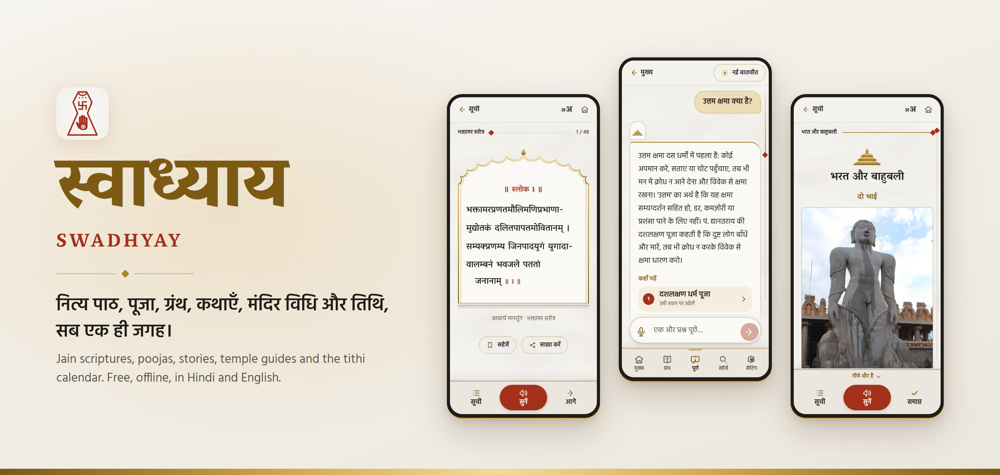
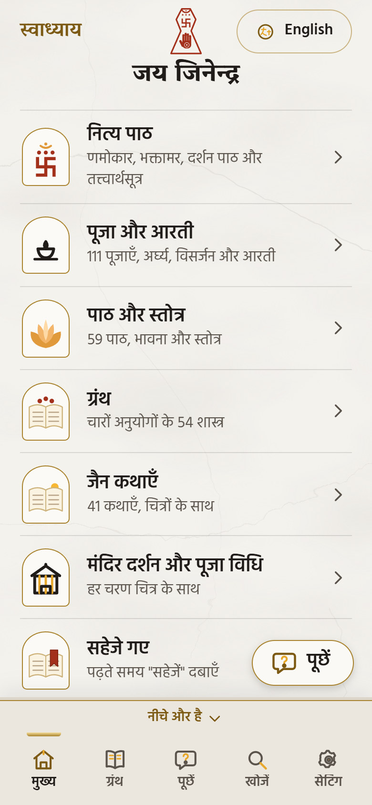
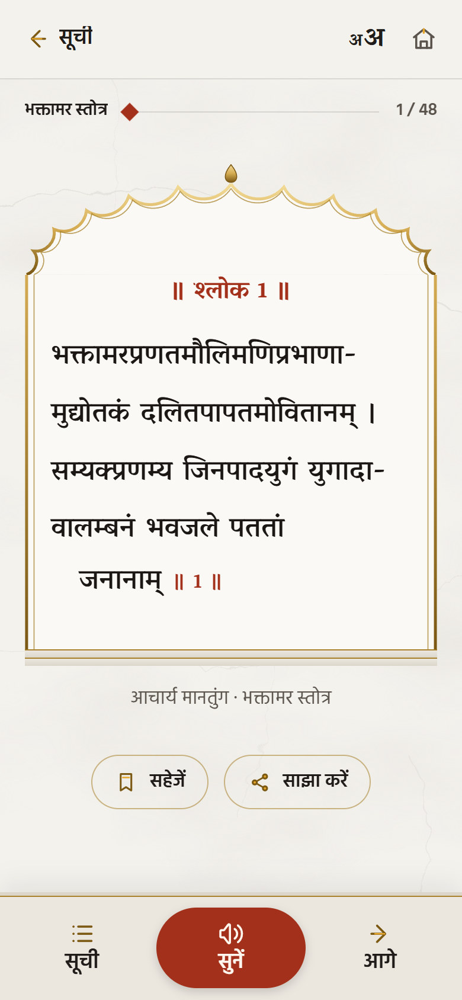
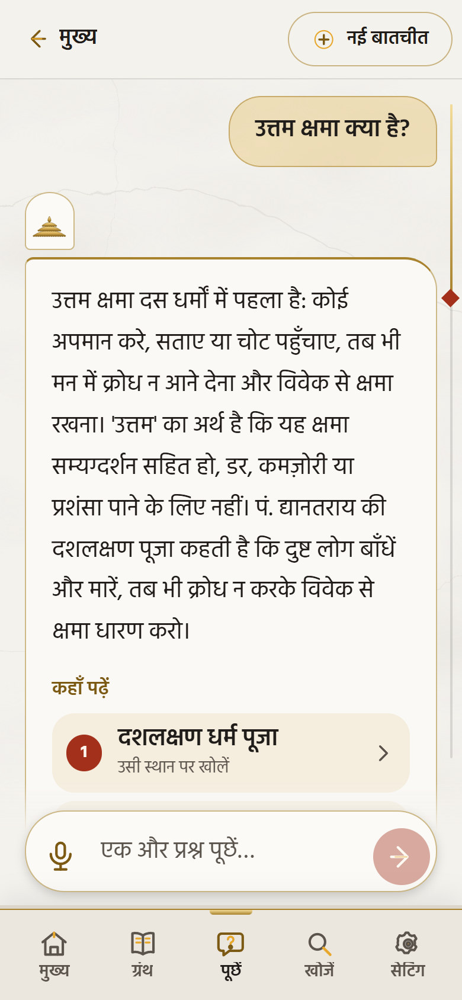
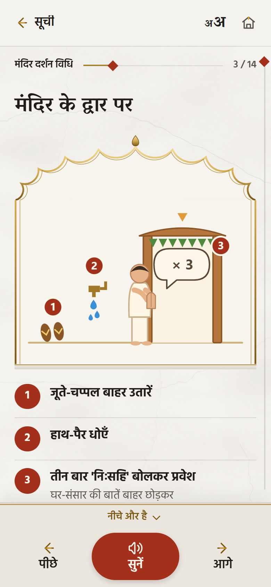
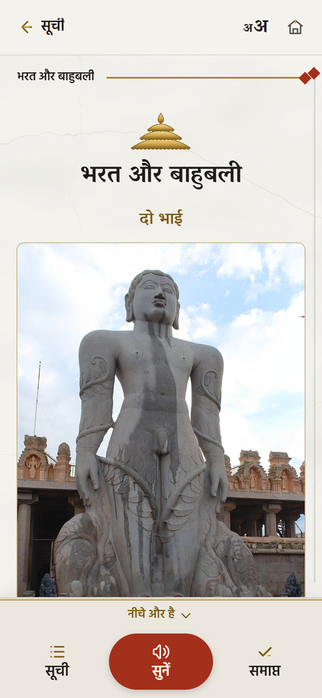
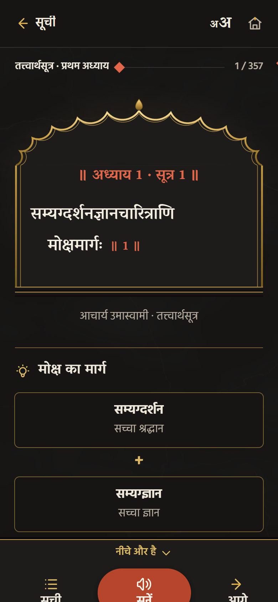

<p align="center">
  <a href="https://arjavtongia.github.io/swadhyay/"></a>
</p>

<p align="center">
  <a href="https://arjavtongia.github.io/swadhyay/"></a>
  
  
  
</p>

<p align="center">
  <b>नित्य पाठ, पूजा, ग्रंथ, कथाएँ, मंदिर विधि और तिथि, सब एक ही जगह।</b><br>
  Jain scriptures, poojas, stories, temple guides and the tithi calendar in one free app, in clear Hindi and English, with large text that also suits elders.
</p>

<p align="center">
  <a href="https://arjavtongia.github.io/swadhyay/"><b>Open Swadhyay</b></a> ·
  <a href="#add-it-to-your-phone">Add it to your phone</a> ·
  <a href="https://github.com/arjavtongia/swadhyay/issues/new?template=text-correction.yml">Report a mistake in a text</a> ·
  <a href="CONTRIBUTING.md">Help improve it</a>
</p>

---

## एक नज़र में · At a glance

<table>
  <tr>
    <td align="center" width="33%"><br><b>मुख्य</b> · Home<br><sub>Everything one tap away</sub></td>
    <td align="center" width="33%"><br><b>पाठ</b> · Read and recite<br><sub>One verse at a time, read aloud</sub></td>
    <td align="center" width="33%"><br><b>प्रश्न पूछें</b> · Ask<br><sub>Answers from the texts, with sources</sub></td>
  </tr>
  <tr>
    <td align="center"><br><b>मंदिर दर्शन विधि</b> · Temple guide<br><sub>Every step drawn</sub></td>
    <td align="center"><br><b>जैन कथाएँ</b> · Stories<br><sub>With photos and a lesson</sub></td>
    <td align="center"><br><b>रात के रंग</b> · Night colours<br><sub>Easy on the eyes in the temple</sub></td>
  </tr>
</table>

## क्या है इसमें · What's inside

| | |
| --- | --- |
| **नित्य पाठ** · Daily paath | Namokar, Bhaktamar, Darshan Path, Darshan Stuti, Barah Bhavana and the Tattvartha Sutra, with meanings and 20 explanatory diagrams |
| **पूजा और आरती** · Poojas | 111 poojas, arghya, visarjan and aartis, including a pooja for each of the 24 Tirthankars and the Diwali pooja |
| **पाठ और स्तोत्र** · Paath and stotras | 59 texts: Meri Bhavana, Chhahdhala, Samayik Path, Kalyan Mandir, Ekibhav and more |
| **ग्रंथ** · Granths | 54 scriptures of the four anuyogs: Samaysar, Pravachansar, Ratnakarand Shravakachar, Gommatsar, the puranas and more |
| **जैन कथाएँ** · Stories | 33 traditional stories with photos of the places they happened, and 8 picture stories for young children |
| **मंदिर और पूजा विधि** · Temple guides | Step-by-step darshan and ashta-dravya pooja guides with every mantra and a drawing for each step |
| **तिथि** · Tithi calendar | Today's tithi and the next 7 days, with ashtami, chaturdashi and festivals marked, worked out on the phone |
| **प्रश्न पूछें** · Ask | Questions about Jain dharma answered from the app's own texts, with links to the verses; 56 common questions work offline |

## बनाया गया सबके लिए · Made for everyone

- **Large, clear text** by default, with six sizes to choose from.
- **Hindi first, with English.** Scripture is never translated away: the original stays, with its meaning below.
- **सुनें · Listen:** each verse is read aloud in a Hindi voice, and the page turns by itself.
- **Works offline** once opened, at home or in the temple, and can be added to the phone's home screen.
- **Day and night colours**, or the same as the phone.
- **Continue where you stopped**, save verses, share a verse on WhatsApp, and search in Hindi or English spellings (भक्तामर or bhaktamar), or by voice.
- **Ask by typing or speaking**, and every answer shows where to read more.

## Add it to your phone

Swadhyay is a web app: there is nothing to download from a store, and it works without internet after the first visit.

- **Android (Chrome):** open [arjavtongia.github.io/swadhyay](https://arjavtongia.github.io/swadhyay/), tap the ⋮ menu, then **Add to Home screen**.
- **iPhone (Safari):** open the link, tap the **Share** button, then **Add to Home Screen**.

## मदद करें · Help improve it

The texts are plain files that anyone can correct.

- **Found a mistake in a text?** [Report it here](https://github.com/arjavtongia/swadhyay/issues/new?template=text-correction.yml) with the book and verse, or fix it yourself on GitHub; [`content/README.md`](content/README.md) explains the format.
- **Something not working, or an idea?** [Open an issue](https://github.com/arjavtongia/swadhyay/issues/new/choose).
- See [CONTRIBUTING.md](CONTRIBUTING.md) for how texts, code and the Ask server fit together.

## सभी पाठ · All the texts

<details>
<summary><b>See every book, pooja, granth and story in the app</b></summary>

| Book | Text |
| --- | --- |
| णमोकार मंत्र एवं मंगल पाठ | Prakrit original, with Hindi and English meanings |
| दर्शन पाठ | Sanskrit, 13 verses |
| दर्शन स्तुति — प्रभु पतित पावन | Pt. Budhjan, 8 stanzas (Hindi) |
| भक्तामर स्तोत्र | Sanskrit original, Digambar tradition, 48 verses |
| बारह भावना | Pt. Bhudhardas, 13 dohas |
| तत्त्वार्थसूत्र | Sanskrit original, Digambar recension, 10 chapters, 357 sutras, with 20 explanatory diagrams |
| मंदिर दर्शन विधि | Temple visit guide, 14 steps (Hindi and English) |
| पूजा विधि | Ashta-dravya pooja guide, 15 steps (Hindi and English) |
| दीपावली पूजन विधि | Diwali pooja at home and on the new bahi: setup steps (Hindi and English), arghyavali, Shri Mahavir Jin Pooja (Vrindavan), Saraswati Pooja (Dyanatray), Nirvan Kand (Bhagwatidas), 64 riddhi arghyas, visarjan and aarti |

#### Jain stories (`content/katha/`, 33 stories)

The stories are listed in five groups:

| Group | Stories |
| --- | --- |
| तीर्थंकर और महापुरुष | Mahavir's childhood (his five names), Bharat and Bahubali, Akshay Tritiya, Neminath and Rajul, Parshvanath and Kamath, Sati Chandana: retold for this app in simple Hindi and English, with photos of Kundalpur, Shravanabelagola, Hastinapur, Girnar, Kashi, Shikharji and Pawapuri |
| आचार्यों की कथाएँ | Acharya Mantunga and the Bhaktamar, Shrutkevali Bhadrabahu, Samantabhadra, Akalank, Patrakesari |
| सम्यग्दर्शन के आठ अंग | Anjan Chor, Anantmati, Raja Uddayan, Revati Rani, Jinendrabhakt Seth, Varishen Muni, Vishnukumar Muni (Rakshabandhan), Vajrakumar Muni, with a diagram of all eight angas |
| व्रत, सत्य और अहिंसा | Yampal Chandal, Mrigsen the fisherman, the little fish Shalisikth, giving up food at night, Raja Vasu, Shribhuti, Neeli |
| मुनि, राजा और श्रेष्ठी | Mahamuni Sukumal and Seth Sudarshan (in chapters), Sukaushal Muni, Gajkumar Muni, Raja Shrenik, Charudatt, Raja Karkandu |

The stories that are not retold come from the Jain Database and the Aradhana Katha Kosh (Br. Nemidatta), in Hindi; each has a short version in Hindi and English and its lesson, written for this app. Photos are from Wikimedia Commons and are credited under each picture; stories without a photo have a drawn picture on their card.

#### Poojas, paath and stotras (`content/pooja/`, 170 texts)

| Group | What's in it |
| --- | --- |
| पूजा से पहले | Abhishek path, prakshal vidhi, vinay path, mangalashtak, pooja prarambh, swasti mangal, darshan paths, abhishek bhajans |
| नित्य पूजाएँ | Dev-Shastra-Guru (5 versions), Siddh pooja (4), Navdevta, Panch Parmeshthi, Samuchchay, Chaubis Tirthankar, Bees Tirthankar, Simandhar, Bahubali, Ratnatray, Dashlakshan, Solahkaran, Saraswati, Panchmeru, Nandishwar, Nirvan Kshetra and more |
| तीर्थंकर पूजाएँ | A pooja for each of the 24 Tirthankars (Vrindavandas), plus other versions for Adinath, Padmaprabh, Vasupujya, Shantinath, Neminath, Parshvanath and Mahavir |
| पर्व पूजाएँ | Kshamavani, Akshay Tritiya, Deepawali, Rakshabandhan, Veer Shasan Jayanti, Shrut Panchami |
| अर्घ्य, शांति पाठ, विसर्जन | Arghyavali, maha arghya, Shanti path (Sanskrit and Hindi), Visarjan path |
| आरती और चालीसा | Panch Parmeshthi, Chandaprabhu, Parshvanath, Mahavir and Bahubali aartis; Adinath and Mahavir chalisa |
| पाठ, भावना और स्तुति | Meri Bhavana, Chhahdhala (Daulatram, with meaning; also Budhjan and Dyanatray), Samayik path (3), Alochana path, Barah Bhavana (2 more), Samadhimaran, Nirvan Kand, Vairagya Bhavana, Dukhharan Vinati, Apurva Avsar, Jain Shatak, Kundkund Shatak and more |
| स्तोत्र | Kalyan Mandir, Ekibhav, Vishapahar, Bhaktamar (with meaning, and two Hindi versions), Swayambhu, Mahavirashtak, Jin Sahasranam, Akalank, Gandharvalay, Mandalasa and more |

Poojas scroll as one page. Stotras and paath that have a meaning for every verse show one verse per screen.

#### Granths (`content/granth/`, 54 books)

Grouped by anuyog: Samaysar, Pravachansar, Niyamsar, Panchastikay, Ashtapahud, Ratnakarand Shravakachar, Purusharthasiddhyupay, Gommatsar, Bhagavati Aradhana, Padmanandi Panchvinshatika, Gyanarnav, Apt Mimansa, Parikshamukh and many more, mostly with Hindi meaning. The puranas and charitras (Adipuran, Padmapuran, Uttarpuran, Mahavir Puran, Jambuswami, Sukumal and Sudarshan Charitra, Aradhana Katha Kosh, Samyaktva Kaumudi) are in Hindi prose, a screen at a time.

</details>

## For developers

Swadhyay is a static site: plain HTML, CSS and JavaScript, with no build step and no framework. It is served by GitHub Pages and works offline through a service worker.

```bash
python -m http.server 8765
```

Then open http://localhost:8765.

<details>
<summary><b>How the code is laid out</b></summary>

| Path | What it holds |
| --- | --- |
| `index.html` | The page that loads the app, and the opening darshan of Bhagwan Mahavir (shown for 3 seconds) |
| `js/app.js` | Screens, reader, search, read-aloud, Ask, settings |
| `js/strings.js` | Every word shown in the app, in Hindi and English |
| `js/panchang.js` | Tithi calculation (sun and moon positions, sunrise in Delhi, purnimanta months) |
| `js/translit.js` | Devanagari to Roman letters |
| `js/ask.js`, `js/askkey.js` | Ask's answers, and the word matching it shares with the server |
| `js/drawings.js`, `js/scenes.js`, `js/kids.js` | Drawings for the temple and pooja guides, story scenes, and the children's pictures |
| `js/ornaments.js`, `js/covers.js` | The mandir's ornaments (chhatra, carved arch, flag, brass rules) and book emblems |
| `js/icons-swadhyay.js`, `js/icons.js` | The app's own icon pack (built from `icons/ui/*.svg` by `tools/build_icons.py`) and Tabler Icons |
| `css/app.css` | Styles, day and night colours |
| `content/` | The book list (`books.json`), categories, diagrams (`chitra.json`), common questions (`faq.json`) and every text |
| `ask-index/` | Search index of every passage for the Ask server, built by `tools/build_ask_index.js` |
| `server/` | The Ask server (a Cloudflare Worker using NVIDIA's model); setup in [`server/README.md`](server/README.md) |
| `sw.js` | Offline support; change `VERSION` when adding or removing files in its list |
| `tools/` | Icon builders, the Ask index builder and the opening-line writer for poojas |
| `DESIGN.md`, `PRODUCT.md` | The design system ("inside the mandir": marble, brass and sindoor) and who the app is for |

To add another language, add a block to `js/strings.js` and the language to `LANGS` at the top of that file.

</details>

## आभार और लाइसेंस · Credits and license

- **App code:** MIT License (see [LICENSE](LICENSE)).
- **Texts in `content/`** (except the two folders below): CC BY-SA 4.0. The original scriptures are centuries old; the transcriptions were checked against [Sanskrit Wikisource](https://sa.wikisource.org/), which is CC BY-SA 4.0.
- **Texts in `content/pooja/` and `content/granth/`:** from the Jain Database, [nikkyjain.github.io](https://nikkyjain.github.io/), with the translators it credits. Its license is not stated; the texts are shared here with credit, for study and worship.
- **Photos in `img/katha/`:** from [Wikimedia Commons](https://commons.wikimedia.org/), public domain, CC0 or CC BY-SA; the photographer and license are shown under each photo in the app.
- **Fonts:** Vesper Libre, Hind and Noto Serif Devanagari, all under the SIL Open Font License (see `fonts/`).
- **Icons:** Swadhyay's own icon pack (`icons/ui/`), and [Tabler Icons](https://tabler.io/icons), MIT License.

Every source is also listed in the app, under Settings → आभार (Credits).

---

<p align="center">
  <br>
  <b>श्रद्धा सहित निर्मित</b> · Made with devotion by <b>Arjav Tongia</b>, Indore<br>
  <sub>जय जिनेन्द्र</sub>
</p>
